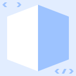

<p align="center">
  
</p>

# React 3D View [](https://github.com/jameswilddev/react-3d-view/actions) [](https://github.com/jameswilddev/react-3d-view/blob/master/license) [](https://renovatebot.com/) [](https://www.npmjs.com/package/react-3d-view) [](https://www.npmjs.com/package/react-3d-view)

A React component which shows a vertex-colored polygonal model in 3D.

## Usage

### Install

Install using NPM:

```bash
npm install --save
```

### Create a Model

TODO

### Display using React

TODO

### Potential Gotchas

TODO
